<div align="center">

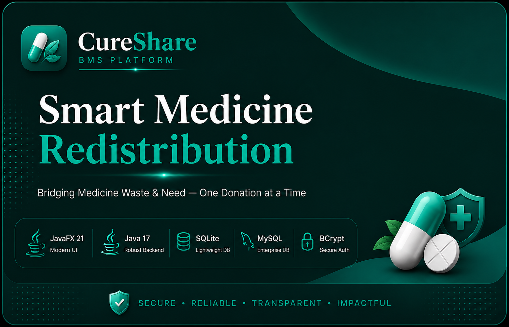

<br/><br/>


<br/><br/>

[](https://github.com/yourusername/CureShare)
[](https://github.com/yourusername/CureShare)
[](https://github.com/yourusername/CureShare/issues)

</div>

---

## ✨ What is CureShare?

**CureShare** is a full-stack desktop Business Management System built with **JavaFX** that tackles a real-world problem: millions of unused medicines are discarded each year while communities in need go without. CureShare creates a verified pipeline from donation → verification → redistribution → impact.

> 4,821 medicines collected · 28 charity partners · ₨186K revenue generated · 12,400 patients served

---

## 🖥️ Screenshots

<table>
<tr>
<td align="center" width="50%">
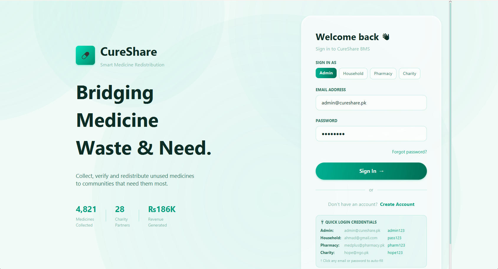
<b>🔐 Login Screen</b><br/>
<sub>Glassmorphism UI with animated background and role selector</sub>
</td>
<td align="center" width="50%">
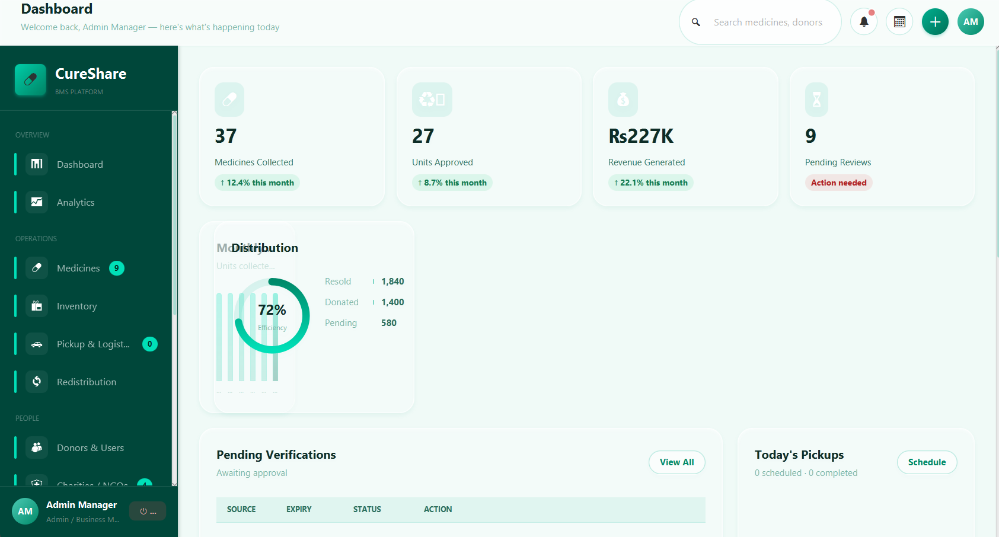
<b>📊 Admin Dashboard</b><br/>
<sub>Real-time KPIs, charts, pending verifications, today's pickups</sub>
</td>
</tr>
<tr>
<td align="center" width="50%">
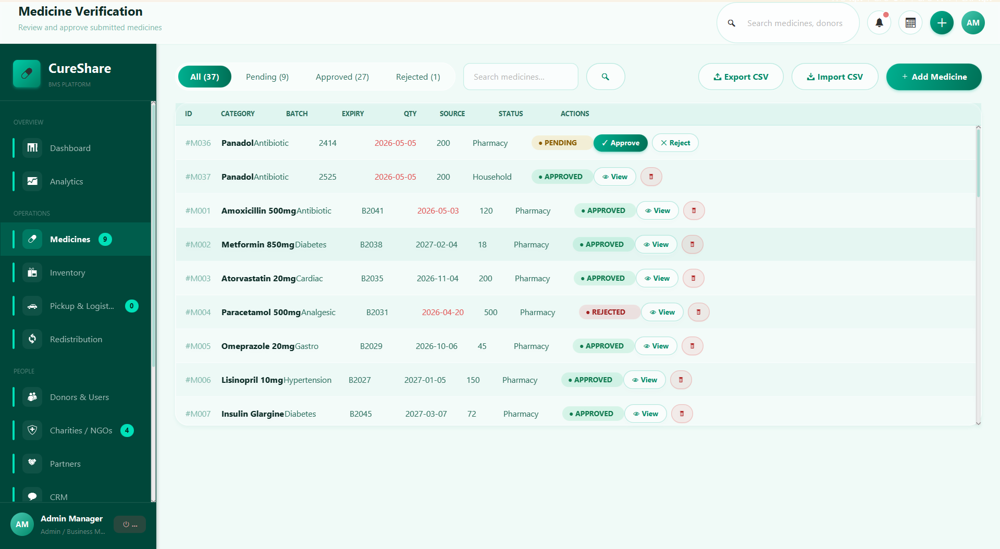
<b>💊 Medicine Verification</b><br/>
<sub>Approve/reject submissions, search, CSV import/export</sub>
</td>
<td align="center" width="50%">
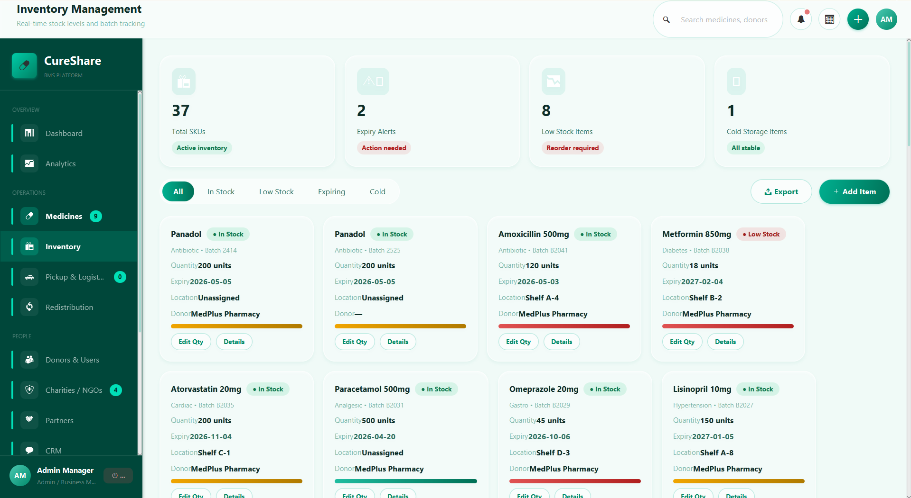
<b>📦 Inventory Management</b><br/>
<sub>Stock cards, cold storage, quarantine, low-stock alerts</sub>
</td>
</tr>
<tr>
<td align="center" width="50%">
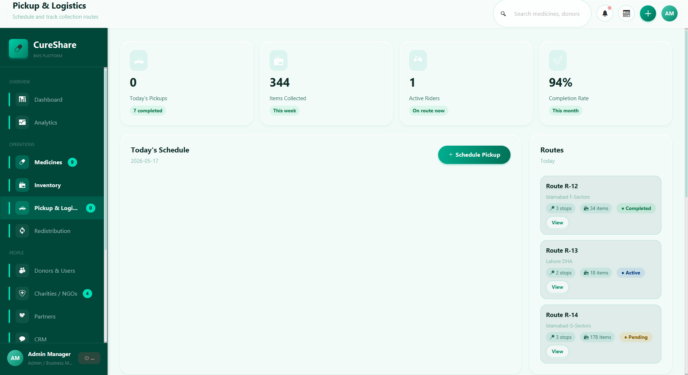
<b>🚗 Pickup & Logistics</b><br/>
<sub>Schedule pickups, assign riders, track routes live</sub>
</td>
<td align="center" width="50%">
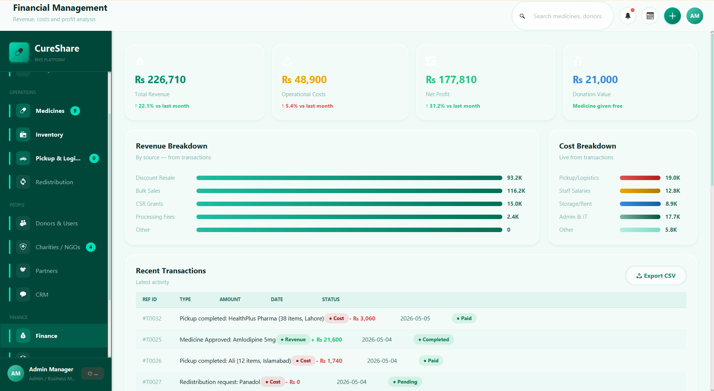
<b>💰 Financial Management</b><br/>
<sub>P&L, revenue breakdown, transactions, break-even analysis</sub>
</td>
</tr>
<tr>
<td align="center" width="50%">
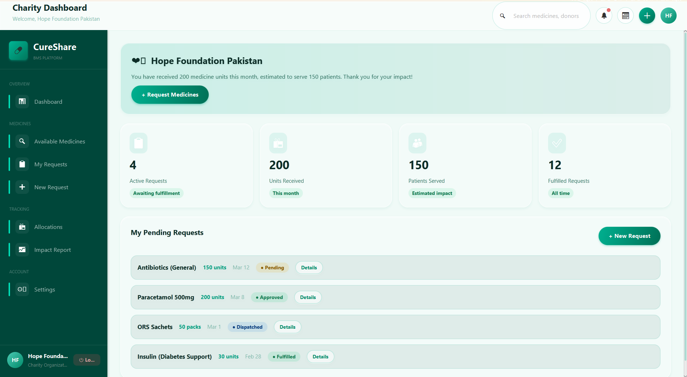
<b>❤️ Charity Dashboard</b><br/>
<sub>Medicine requests, allocation tracking, impact metrics</sub>
</td>
<td align="center" width="50%">
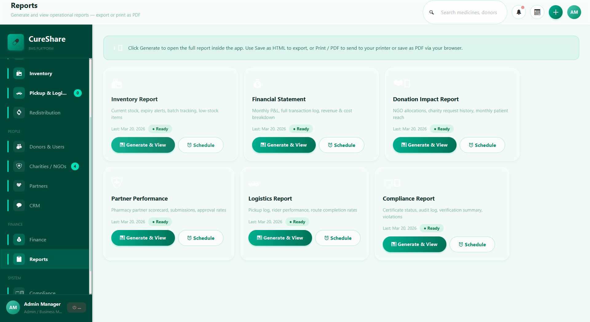
<b>📋 Report Viewer</b><br/>
<sub>6 in-app HTML reports — save as HTML or print to PDF</sub>
</td>
</tr>
<tr>
<td align="center" width="50%">
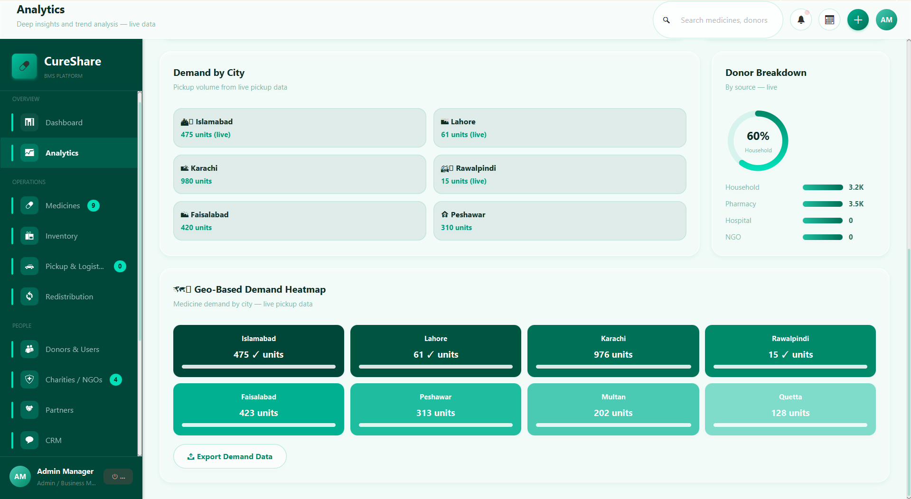
<b>📈 Analytics</b><br/>
<sub>Live category charts, geo heatmap, donor breakdown</sub>
</td>
<td align="center" width="50%">
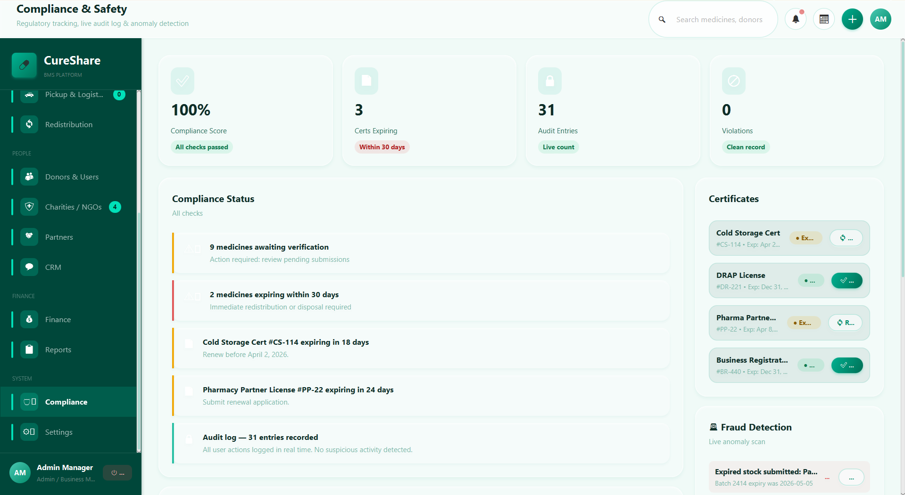
<b>🛡️ Compliance & Audit</b><br/>
<sub>Live audit log, fraud detection, certificate tracker</sub>
</td>
</tr>
</table>

---

## 🎯 Features at a Glance

<table>
<tr><td>

### 👤 Four Role Dashboards
- **Admin** — Full BMS control center (16 screens)
- **Household** — Submit medicines, track points & cashback
- **Pharmacy** — Bulk CSV upload, expiry tracker, resale agreements
- **Charity / NGO** — Request medicines, track allocations & impact

</td><td>

### 🏗️ Core Modules
- 💊 Medicine collection, verification & inventory
- 🚗 Pickup scheduling & route management
- 🔄 FIFO-based redistribution engine
- 💰 Financial management & break-even analysis
- 📋 6 in-app report types with save/print as PDF
- 🛡️ Compliance, audit log & fraud detection

</td></tr>
<tr><td>

### 🧠 Smart Features
- 📈 Dynamic pricing by expiry proximity (auto-discount)
- 🔍 Live fraud anomaly scanning (duplicate batches, expired stock)
- 🗺️ Geo-demand heatmap by city
- ⭐ Points & cashback rewards for donors
- 📊 Analytics with live data binding
- 🔔 Notification center & calendar widget

</td><td>

### 🛢️ Database Options
- ✅ **Demo mode** — zero setup, runs instantly
- ✅ **SQLite** — auto-creates `cureshare.db`, no server needed
- ✅ **MySQL** — production-ready with full schema
- 🔒 BCrypt password hashing (work factor 12)
- 📝 Full audit log persisted to DB in real-time

</td></tr>
</table>

---

## 🚀 Quick Start

### Prerequisites
- Java 17+
- Maven 3.8+

### Option 1 — One Command
```bash
git clone https://github.com/yourusername/CureShare.git
cd CureShare
mvn javafx:run
```

### Option 2 — Eclipse (Recommended)
1. **File → Import → Maven → Existing Maven Projects** → select the `CureShare` folder
2. Wait for dependencies (~1 min, internet required)
3. Right-click → **Maven → Update Project** → OK
4. **Run Configurations** → Java Application → Main class: `com.cureshare.app.MainApp`
5. Add VM arguments from `ECLIPSE_VM_ARGS.txt`
6. Click **Run** ✅

### Option 3 — Windows
Double-click **`run.bat`**

---

## 🔑 Demo Credentials

| Role | Email | Password |
|------|-------|----------|
| 🔧 **Admin** | `admin@cureshare.pk` | `admin123` |
| 🏠 **Household** | `ahmad@gmail.com` | `pass123` |
| 💊 **Pharmacy** | `medplus@pharmacy.pk` | `pharm123` |
| ❤️ **Charity** | `hope@ngo.pk` | `hope123` |

> 💡 On the login screen, click any email or password to auto-fill it.

---

## 🗄️ Database Setup

Ships in **SQLite mode** by default — no configuration needed. One file, `cureshare.db`, is auto-created.

```java
// DatabaseConfig.java — change ONE line to switch:
public static final String MODE = "sqlite";  // "demo" | "sqlite" | "mysql"
```

### MySQL (Optional)
```bash
mysql -u root -p < cureshare_schema.sql
```
Then set `MODE = "mysql"` and update your password in `DatabaseConfig.java`.

---

## 🏛️ Architecture

```
CureShare/
├── src/main/java/com/cureshare/
│   ├── app/
│   │   └── MainApp.java                  # JavaFX entry point
│   ├── models/
│   │   ├── User.java                     # Role-based user model
│   │   ├── Medicine.java                 # Medicine lifecycle model
│   │   ├── Pickup.java                   # Logistics model
│   │   ├── CharityRequest.java           # NGO request model
│   │   └── Transaction.java              # Financial model
│   ├── utils/
│   │   ├── DataStore.java                # Facade → routes to SQLite/MySQL/demo
│   │   ├── SQLiteDataStore.java          # Full SQLite implementation
│   │   ├── MySQLDataStore.java           # Full MySQL implementation
│   │   ├── DatabaseConfig.java           # ← flip one line to switch DB mode
│   │   ├── AuditLog.java                 # Real-time action logging
│   │   ├── CsvExporter.java              # CSV + receipt file export
│   │   ├── PasswordUtil.java             # BCrypt hashing
│   │   ├── SessionManager.java           # Login session state
│   │   ├── AnimationUtils.java           # Fade, scale, stagger, counter
│   │   └── Theme.java                    # Design token constants
│   └── views/
│       ├── auth/
│       │   ├── LoginScreen.java          # Glassmorphism login
│       │   └── SignupScreen.java         # Role-based registration
│       ├── dashboard/
│       │   ├── BaseLayout.java           # Sidebar + header shell (shared)
│       │   ├── AdminDashboard.java       # Full admin BMS (16 pages)
│       │   ├── HouseholdDashboard.java   # Donor portal
│       │   ├── PharmacyDashboard.java    # Partner portal
│       │   ├── CharityDashboard.java     # NGO portal
│       │   └── ReportViewer.java         # In-app HTML report engine
│       └── shared/
│           └── UIComponents.java         # Reusable glass-design component library
├── screenshots/                          # ← put your screenshots here
├── cureshare_schema.sql                  # MySQL schema + seed data
├── pom.xml
├── run.bat
└── ECLIPSE_VM_ARGS.txt
```

---

## 🧩 Tech Stack

| Layer | Technology |
|-------|-----------|
| UI Framework | JavaFX 21 — custom glassmorphism design system |
| Language | Java 17 |
| Build | Apache Maven |
| Database | SQLite (`sqlite-jdbc`) · MySQL (`mysql-connector-j`) |
| Security | BCrypt via `jbcrypt` |
| Typography | Syne (headings) · DM Sans (body) |
| Reports | JavaFX WebEngine → HTML → native print dialog (PDF) |
| Animations | Custom `AnimationUtils` — fade, scale, stagger, counter |

---

## 🔒 Security

- All passwords hashed with **BCrypt (work factor 12)** — never stored in plain text
- Authentication runs on a **background thread** — UI never freezes
- **Audit log** records every action (login, approve, delete, setting change) to the database
- **Live fraud detection** scans for duplicate batch numbers, expired stock submissions, and abnormal quantities

---

## 📤 CSV Export / Import

Every major dataset exportable from inside the app:

```
Medicines  ·  Inventory  ·  Transactions  ·  Users  ·  Pickups
Charity Requests  ·  My Submissions  ·  Audit Log  ·  Pickup Receipts (.txt)
```

CSV import supported with flexible date parsing (`YYYY-MM-DD`, `M/d/yyyy`, `MM/dd/yyyy`).

---

## 🌱 Auto-Seeded Demo Data

On first run the app seeds:
- **16 users** — 1 admin, 6 household, 4 pharmacy, 5 charity
- **35 medicines** — 10+ categories, varied statuses, some expiring soon
- **20 financial transactions** — revenue, costs, donations
- **10 pickups** — multiple riders, routes, cities
- **10 charity requests** — at various fulfillment stages

---

## 🤝 Contributing

1. Fork the repo
2. Create your branch: `git checkout -b feature/amazing-feature`
3. Commit: `git commit -m 'Add amazing feature'`
4. Push: `git push origin feature/amazing-feature`
5. Open a Pull Request

---

## 📄 License

Distributed under the MIT License. See `LICENSE` for more information.

---

<div align="center">
Made with ❤️ for communities that need it most.<br/>
<b>CureShare — Smart Medicine Redistribution BMS</b><br/>
<i>Every donation matters.</i>
</div>
